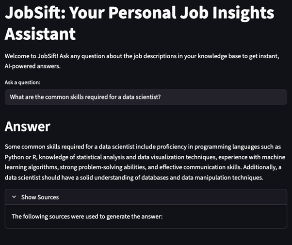
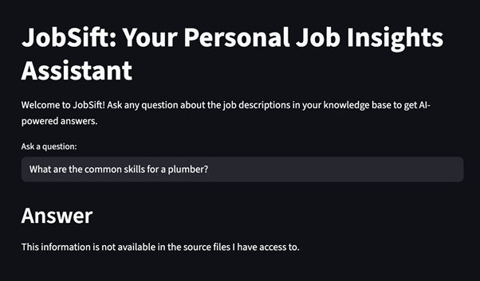
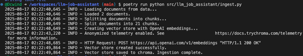
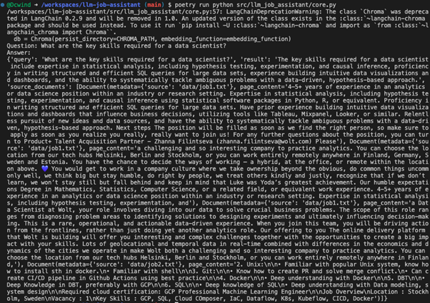
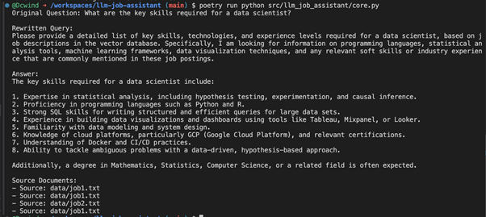
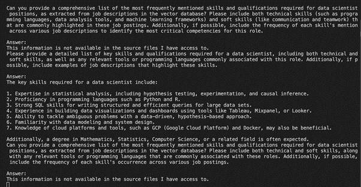
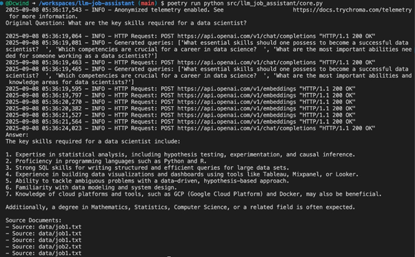
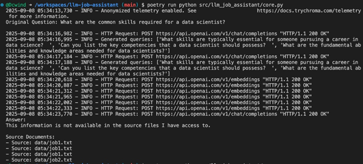
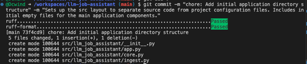
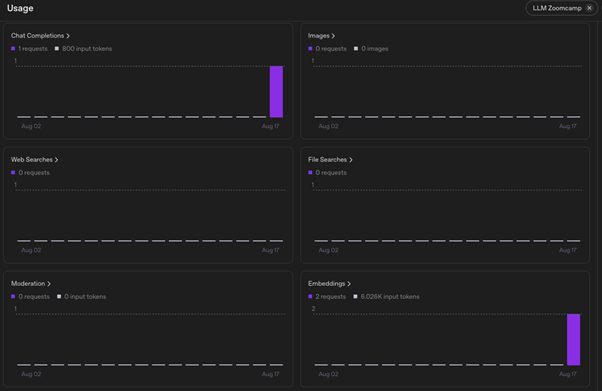

# JobSift: An LLM-Powered Job Application Research & Insights Assistant

## Introduction

JobSift is a RAG (Retrieval-Augmented Generation) assistant that transforms your saved job postings into an interactive career insights platform. It helps you discover key skill requirements, identify personal skill gaps, and strategically tailor your job applications through intelligent document analysis and conversational AI.

---

## Problem Statement

In today's competitive job market, job seekers face several challenges:

- **Information Overload**: Manually tracking and analyzing dozens of job descriptions is time-consuming and inefficient
- **Skill Gap Identification**: Difficulty in systematically identifying missing skills across multiple job postings
- **Application Personalization**: Creating tailored applications for each position requires deep analysis of requirements
- **Market Intelligence**: Understanding industry trends and skill demands across saved job opportunities

JobSift solves these problems by providing an intelligent, conversational interface to your job search data, enabling data-driven career decisions.

---

## Core Features

### 🤖 **Conversational Q&A**
- Ask natural language questions about your saved job postings
- Get grounded, cited answers with source attribution
- Advanced multi-query retrieval for comprehensive results

### 📊 **Intelligent Document Processing**
- Automated ingestion of job descriptions from text files
- Smart text chunking and embedding generation
- Persistent vector storage for fast retrieval

---

## System Architecture


---

## Technology Stack

| Component | Technology | Purpose |
|-----------|------------|---------|
| **LLM Framework** | LangChain | RAG pipeline orchestration |
| **Language Model** | OpenAI GPT-4o-mini | Question answering and reasoning |
| **Embeddings** | OpenAI Embeddings | Document vectorization |
| **Vector Database** | ChromaDB | Semantic search and retrieval |
| **Frontend** | Streamlit | Interactive web interface |
| **Package Management** | Poetry | Dependency management |
| **Development** | Python 3.11+ | Core development platform |

---

## Setup

### Prerequisites

- Python 3.11 or higher
- Poetry (for dependency management)
- OpenAI API key

### Installation Instructions

#### 1. Initial Setup

**1.1. Clone the Repository**

```bash
git clone https://github.com/Dcwind/llm-job-assistant.git
cd llm-job-assistant
```

**1.2. Install Dependencies with Poetry**

```bash
# Install all dependencies
poetry install

# Activate the virtual environment
poetry shell
```

**1.3. Set Up Environment Variables**

Create a `.env` file in the project root:

```bash
# Create with your OpenAI API key
echo "OPENAI_API_KEY=your_openai_api_key_here" > .env
```

#### 2. Data Preparation

**2.1. Prepare Job Descriptions**

Place your job description text files in one of these directories:

- `data/` - For your personal job postings (create this directory)
- `sample_data/` - Contains sample data for testing (already included)

The system will automatically use the `data/` directory if it exists, otherwise it falls back to `sample_data/`.

**2.2. Run Document Ingestion**

```bash
# Navigate to the source directory and run ingestion
cd src/llm_job_assistant
poetry run python ingest.py
```

This will:
- Load all `.txt` files from your data directory
- Split documents into optimal chunks
- Generate embeddings using OpenAI
- Store vectors in ChromaDB for fast retrieval

#### 3. Running the Application

**3.1. Start the Streamlit Interface**

```bash
# From the src/llm_job_assistant directory
poetry run streamlit run app.py

# Or use the CLI wrapper
poetry run python cli.py
```

**3.2. Access the Application**

Open your browser to `http://localhost:8501` to access the JobSift interface.

---

## Usage

### Basic Queries

Once the application is running, you can ask questions like:

- "What are the common skills required for a data scientist?"
- "What experience level is typically required for data scientist roles?"
- "Show me jobs that mention Python programming"

### Advanced Features

The RAG system uses multi-query retrieval, which means:
- Your questions are automatically reformulated from multiple perspectives
- Results are gathered from different semantic angles
- Answers are more comprehensive and accurate

### Source Attribution

Every answer includes:
- **Grounded responses** based on your actual job postings
- **Source citations** showing which documents were used
- **Context snippets** for verification and deeper exploration

---

## Project Structure

```
llm-job-assistant-main/
│
├── src/
│   └── llm_job_assistant/          # Main application package
│       ├── app.py                  # Streamlit web interface
│       ├── cli.py                  # Command-line interface wrapper
│       ├── core.py                 # RAG chain implementation
│       └── ingest.py               # Document processing pipeline
│
├── sample_data/                    # Sample job postings
│
├── data/                          # Your personal job postings (create this)
│   └── *.txt                      # Place your job descriptions here
│
├── chroma/                        # Vector database storage (auto-created)
│
├── .env                           # Environment variables (create this)
├── poetry.lock                    # Locked dependency versions
├── pyproject.toml                 # Project configuration and dependencies
└── README.md                      # This documentation
```

---

## How It Works

### Document Ingestion (`ingest.py`)
- Loads text documents from the data directory using DirectoryLoader
- Splits documents into chunks using RecursiveCharacterTextSplitter (1000 chars with 200 overlap)
- Creates embeddings using OpenAI and stores them in ChromaDB
- Skips ingestion if vector store already exists

### RAG Chain (`core.py`)
- Uses MultiQueryRetriever to generate multiple query variations
- Implements ChatOpenAI with GPT-4o-mini for question answering
- Returns answers with source document attribution
- Provides fallback message when information is not available

### Web Interface (`app.py`)
- Streamlit-based UI for asking questions
- Displays answers with expandable source sections
- Includes error handling for better user experience
- Caches the QA chain for improved performance

---

## Screenshots

### Web Interface

**Main Application Interface**



*The main Streamlit interface where users can ask questions about their job postings and receive AI-powered insights.*

**Information Not Found Response**



*When the system cannot find relevant information, it provides a helpful fallback message to guide users.*

---

### Development & Processing

**Document Ingestion Success**



*Successful completion of the document ingestion process, showing job descriptions being processed and stored in the vector database.*

**Core RAG Pipeline**



*The RAG (Retrieval-Augmented Generation) pipeline running successfully, demonstrating the system's ability to retrieve and generate responses.*

---

### Query Processing & Multi-Query Retrieval

**Query Rewrite Feature**



*Demonstration of the multi-query retrieval system that automatically reformulates user questions for better results.*

**Enhanced Query Processing**



*Advanced query rewriting showing how the system generates multiple perspectives of the same question.*

**Multi-Query Retrieval in Action**



*The multi-query retrieval system working to improve answer quality by exploring different semantic angles.*

**Fallback Response**



*When information cannot be found despite query reformulation, the system provides appropriate feedback.*

---

### Development Tools & Monitoring

**Code Quality with Pre-commit**



*Pre-commit hooks running with Ruff linter to maintain code quality and consistency.*

**OpenAI API Usage Dashboard**



*OpenAI API usage monitoring dashboard showing token consumption and API calls for cost tracking.*

---

## License

This project is licensed under the MIT License.